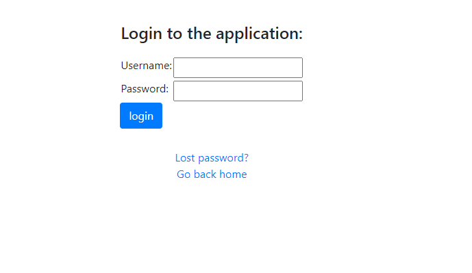
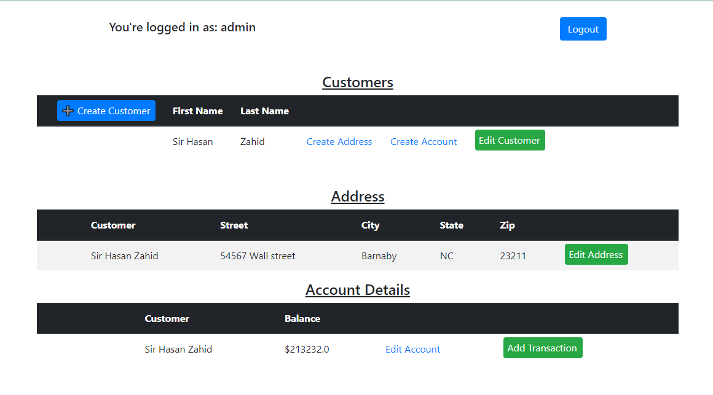

# IT 409 Django Midterm Project

Basic dashboard for an online shop 

---

### Learned
- Django project structure
- Django modules and their functions
- Django views
- Django models
- Django Validators
- Django testing 
- Django forms 
- Authentication using Django auth module
- Authorization using Django auth decorators
- Django templates

### Problem(s) faced:
- Had a minor issue conceptualizing the distinction between the models and forms and how the views affected them

### Solution to problem:
- Tested by changing form structure to see how a different form view affected the models and vice-versa.
